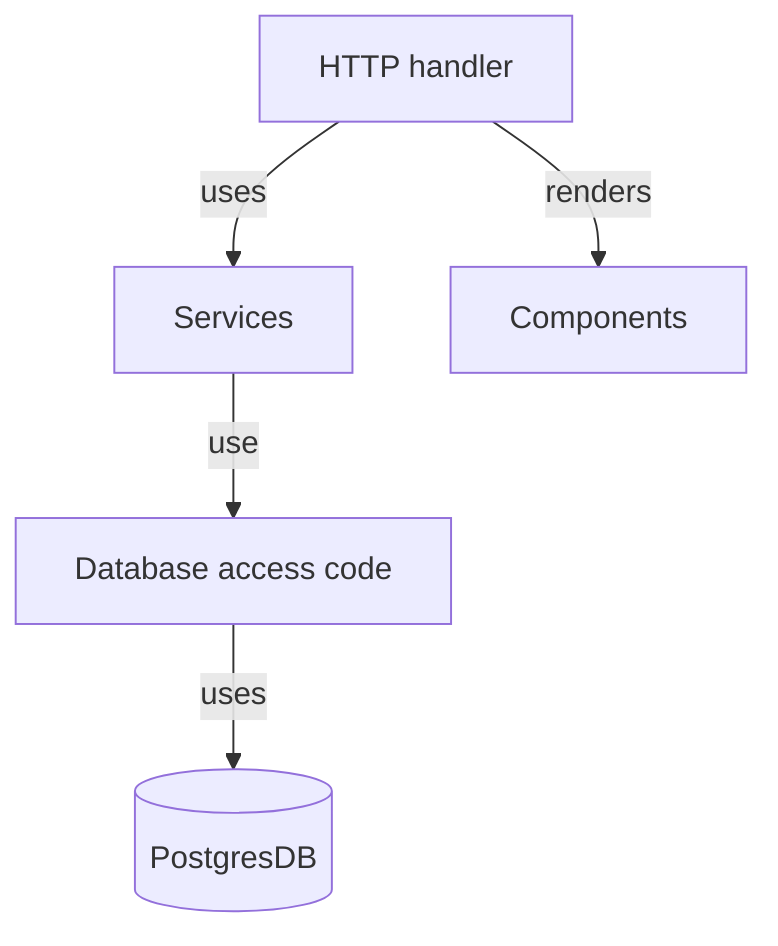

## Architecture

The application is divided up into multiple packages, each with its own purpose.

* `api` - Entry Point, Wiring
* `handler` - HTTP handlers.
* `services` - Services used by the handlers.
* `db` - Database access code
* `component` - templ components.

## Infrastructure

**[Task](https://github.com/go-task/task)**

Task is a task runner / build tool that aims to be simpler and easier to use than, for example, GNU Make.

**[TEMPL](https://github.com/a-h/templ)**  

Create components that render fragments of HTML and compose them to create screens, pages, documents, or apps.

**[Migrate](https://github.com/golang-migrate/migrate)**

Database migrations.